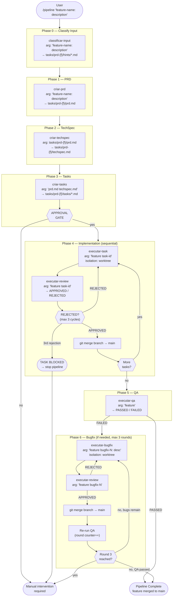

# Agent Pipeline — Claude Code

This folder contains the Claude Code implementation of the agent pipeline. Each phase is a slash command (`.md` file) invoked via `/command-name` in Claude Code.

## Workflow



## Differences from the Copilot version

| Aspect | Claude Code | Copilot (VS Code) |
|--------|-------------|-------------------|
| **Entry point** | `/pipeline "..."` slash command in any terminal | Select **Pipeline** agent mode in Copilot Chat (`Ctrl+Alt+I`) |
| **Sub-agent spawning** | `Agent` tool with `isolation: "worktree"` primitive | `agents:` frontmatter field; Pipeline invokes sub-agents via `runSubagent` |
| **Worktree isolation** | First-class `isolation: "worktree"` flag on the agent invocation | Explicit `git worktree add .worktrees/{feature}-task-{id}` terminal commands inside each agent |
| **Context isolation** | Enforced by the Claude Code runtime | Enforced by sub-agent boundary — each agent only sees files it reads from disk |
| **Command naming** | `/classificar-input`, `/criar-prd`, `/criar-techspec`, `/criar-tasks`, `/executar-task`, `/executar-review`, `/executar-qa`, `/executar-bugfix` | `Classifier Agent` (internal), `PRD Agent`, `TechSpec Agent`, `Tasks Agent`, `Task Implementation Agent`, `Review Agent`, `QA Agent`, `Bugfix Agent` |
| **Command files** | `.claude/commands/*.md` → installed to `~/.claude/commands/` | `.copilot/agents/*.agent.md` → installed to `~/.vscode-server/data/User/prompts/` (Linux) |
| **Self-reading commands** | Each orchestrator reads sub-command files at runtime to stay in sync | Sub-agents are referenced by name in `agents:` frontmatter; the runtime resolves them |
| **Phase 4 sequencing** | Strictly sequential, enforced by orchestrator loop | Strictly sequential, enforced by Pipeline agent loop (explicitly documented as critical) |
| **Phase 6 bugfix branching** | Each bugfix gets its own worktree via the `isolation: "worktree"` flag | Each bugfix explicitly runs `git worktree add .worktrees/{feature}-bugfix-{N}` before fixing |
| **Review max cycles** | 3 cycles before BLOCKED | 3 cycles before BLOCKED (identical logic) |
| **QA max rounds** | 3 total QA rounds | 3 total QA rounds (identical logic) |
| **Conventions file** | `CLAUDE.md` | `CLAUDE.md`, `AGENTS.md`, or `.github/copilot-instructions.md` (tries all three) |
| **Model** | Claude (depends on config) | `Auto (copilot)` — uses whatever model Copilot has active |

## Commands

| Command | File | User-invocable? | Description |
|---------|------|-----------------|-------------|
| `/pipeline` | `pipeline.md` | ✅ | Full orchestrated pipeline: PRD → TechSpec → Tasks → Implement → QA |
| `/classificar-input` | `classificar-input.md` | ✅ | Pre-process input into per-domain hint files for downstream agents |
| `/criar-prd` | `criar-prd.md` | ✅ | Generate a PRD with clarification questions |
| `/criar-techspec` | `criar-techspec.md` | ✅ | Generate a TechSpec from a PRD |
| `/criar-tasks` | `criar-tasks.md` | ✅ | Decompose PRD+TechSpec into ordered tasks |
| `/executar-task` | `executar-task.md` | ✅ | Implement a single task with TDD + internal review loop |
| `/executar-review` | `executar-review.md` | ✅ | Code review against PRD/TechSpec/CLAUDE.md conventions |
| `/executar-qa` | `executar-qa.md` | ✅ | E2E QA via Playwright MCP |
| `/executar-bugfix` | `executar-bugfix.md` | ✅ | Reproduce, fix, test, and review a bug |

## Requirements

- A `CLAUDE.md` in the target project documenting conventions, test command, and lint command
- Playwright MCP configured for `/executar-qa`
- Dev server running locally when QA is executed

## Installation

From the repo root:

```bash
./install.sh
```

Commands are installed to `~/.claude/commands/` and become available as slash commands globally in Claude Code. Re-run at any time to update.
