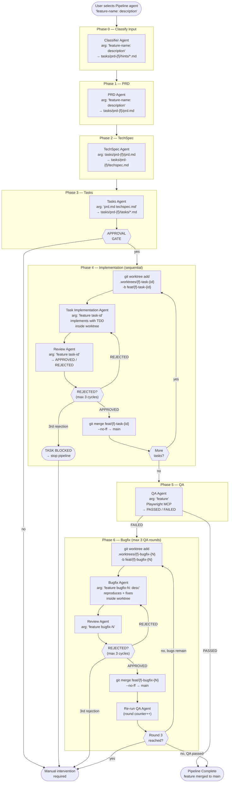

# Agent Pipeline — GitHub Copilot (VS Code)

This folder contains the Copilot equivalent of the Claude Code agent pipeline. Each phase is implemented as a `.agent.md` file and invoked as a custom agent mode in Copilot Chat.

## Workflow



## Differences from the Claude Code version

| Aspect | Claude Code | Copilot (VS Code) |
|--------|-------------|-------------------|
| **Entry point** | `/pipeline "..."` slash command in any terminal | Select **Pipeline** agent mode in Copilot Chat (`Ctrl+Alt+I`) |
| **Sub-agent spawning** | `Agent` tool with `isolation: "worktree"` primitive | `agents:` frontmatter field; Pipeline invokes sub-agents via `runSubagent` |
| **Worktree isolation** | First-class `isolation: "worktree"` flag on the agent invocation | Explicit `git worktree add .worktrees/{feature}-task-{id}` terminal commands inside each agent |
| **Context isolation** | Enforced by the Claude Code runtime | Enforced by sub-agent boundary — each agent only sees files it reads from disk, never the orchestrator's conversation history |
| **Command naming** | `/classificar-input`, `/criar-prd`, `/criar-techspec`, `/criar-tasks`, `/executar-task`, `/executar-review`, `/executar-qa`, `/executar-bugfix` | `Classifier Agent` (internal), `PRD Agent`, `TechSpec Agent`, `Tasks Agent`, `Task Implementation Agent`, `Review Agent`, `QA Agent`, `Bugfix Agent` |
| **Command files** | `.claude/commands/*.md` → installed to `~/.claude/commands/` | `.copilot/agents/*.agent.md` → installed to `~/.vscode-server/data/User/prompts/` (Linux) |
| **Self-reading commands** | Each orchestrator reads sub-command files at runtime to stay in sync | Sub-agents are referenced by name in `agents:` frontmatter; the runtime resolves them |
| **Phase 4 sequencing** | Strictly sequential, enforced by orchestrator loop | Strictly sequential, enforced by Pipeline agent loop (explicitly documented as critical) |
| **Phase 6 bugfix branching** | Each bugfix gets its own worktree via the `isolation: "worktree"` flag | Each bugfix explicitly runs `git worktree add .worktrees/{feature}-bugfix-{N}` before fixing |
| **Review max cycles** | 3 cycles before BLOCKED | 3 cycles before BLOCKED (identical logic) |
| **QA max rounds** | 3 total QA rounds | 3 total QA rounds (identical logic) |
| **Conventions file** | `CLAUDE.md` | `CLAUDE.md`, `AGENTS.md`, or `.github/copilot-instructions.md` (tries all three) |
| **Model** | Claude (Sonnet/Opus depending on config) | `Auto (copilot)` — uses whatever model Copilot has active |

## Agents

| Agent | File | Standalone? | Description |
|-------|------|-------------|-------------|
| `Pipeline` | `Pipeline.agent.md` | ✅ | Full orchestrated pipeline: PRD → TechSpec → Tasks → Implement → QA |
| `Classifier Agent` | `Classifier.agent.md` | ❌ | Pre-process input into per-domain hint files (called by Pipeline, not user-invocable) |
| `PRD Agent` | `PRD.agent.md` | ✅ | Generate a PRD with clarification questions |
| `TechSpec Agent` | `TechSpec.agent.md` | ✅ | Generate a TechSpec from a PRD |
| `Tasks Agent` | `Tasks.agent.md` | ✅ | Decompose PRD+TechSpec into ordered tasks |
| `Task Implementation Agent` | `TaskImpl.agent.md` | ✅ | Implement a single task with TDD + review loop in a git worktree |
| `Review Agent` | `Review.agent.md` | ✅ | Code review against PRD/TechSpec/conventions |
| `QA Agent` | `QA.agent.md` | ✅ | E2E QA via Playwright MCP |
| `Bugfix Agent` | `Bugfix.agent.md` | ✅ | Reproduce, fix, test, and review a bug in a git worktree |

## Requirements

- A `CLAUDE.md`, `AGENTS.md`, or `.github/copilot-instructions.md` in the target project documenting conventions, test command, and lint command
- Playwright MCP configured for the QA Agent
- Dev server running locally when QA is executed
- VS Code with GitHub Copilot Chat extension

## Installation

From the repo root:

```bash
./install-copilot.sh
```

Agents are installed to `~/.vscode-server/data/User/prompts/` (Linux) and become available as agent modes in Copilot Chat. Re-run at any time to update.
