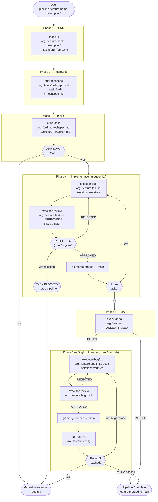

# Agent Pipeline

AI-driven feature development pipeline — available for both **Claude Code** and **GitHub Copilot (VS Code)**.

## Installation

### Claude Code

```bash
git clone https://github.com/vmourac/agent-pipeline.git
cd agent-pipeline
./install.sh
```

Commands are installed to `~/.claude/commands/` and become available as `/pipeline`, `/criar-prd`, etc. in any project.

### GitHub Copilot (VS Code)

```bash
git clone https://github.com/vmourac/agent-pipeline.git
cd agent-pipeline
./install-copilot.sh
```

Agents are installed to the VS Code user-level prompts directory and become available as custom agent modes in Copilot Chat. Re-run at any time to update.

> **Requirements for Copilot pipeline:** A `CLAUDE.md` (or `AGENTS.md` / `.github/copilot-instructions.md`) in the target project documenting conventions, test command, and lint command. Playwright MCP configured for QA phase.

## Commands

| Command | Arguments | Description |
| --- | --- | --- |
| `/pipeline` | `"feature-name: description"` or `path/to/spec.md` | Full orchestrated pipeline: PRD → TechSpec → Tasks → Implement → QA |
| `/criar-prd` | `"feature-name: description"` or `path/to/spec.md` | Generate a PRD with clarification questions |
| `/criar-techspec` | `tasks/prd-{feature}/prd.md` | Generate a TechSpec from a PRD |
| `/criar-tasks` | `tasks/prd-{feature}/prd.md tasks/prd-{feature}/techspec.md` | Decompose PRD+TechSpec into ordered tasks |
| `/executar-task` | `"feature task-id"` or `path/to/args.txt` | Implement a single task with TDD + internal review loop |
| `/executar-review` | `"feature task-id-or-bugfix-N"` or `path/to/args.txt` | Code review against PRD/TechSpec/CLAUDE.md conventions |
| `/executar-qa` | `"feature"` or `path/to/feature.txt` | E2E QA via Playwright MCP |
| `/executar-bugfix` | `"feature bugfix-N: description"` or `path/to/bug.md` | Reproduce, fix, test, and review a bug |

## Workflow



## Examples

### Run the full pipeline on a new feature

Inline string:

```text
/pipeline "user-notifications: add in-app notification bell with unread count and dismiss"
```

Or from a file (useful for longer specs):

```text
/pipeline specs/user-notifications.md
```

Where `specs/user-notifications.md` contains the feature name and description. The orchestrator will ask clarification questions, generate all planning artifacts, present the task list for your approval, then implement each task in sequence — each in its own worktree, with TDD and code review — merging back to main as it goes.

---

### Run planning steps manually, then implement

Use this when you want to review or edit the PRD/TechSpec before committing to implementation.

**Step 1 — Generate the PRD:**

```text
/criar-prd "dark-mode: allow users to toggle between light and dark themes"
```

**Step 2 — Generate the TechSpec from the PRD:**

```text
/criar-techspec tasks/prd-dark-mode/prd.md
```

**Step 3 — Decompose into tasks:**

```text
/criar-tasks tasks/prd-dark-mode/prd.md tasks/prd-dark-mode/techspec.md
```

**Step 4 — Implement a single task:**

```text
/executar-task "dark-mode 1.0"
```

Repeat Step 4 for each subsequent task in dependency order.

---

### Implement one task in isolation (no full pipeline)

Useful for resuming a paused pipeline or retrying a blocked task:

```text
/executar-task "sidebar-badge 3.0"
```

The agent reads the task file, verifies dependencies are met in the current codebase, implements with TDD, and loops through review until approved.

---

### Trigger a code review manually

```text
/executar-review "dark-mode 2.0"
```

For a bugfix review:

```text
/executar-review "dark-mode bugfix-1"
```

---

### Fix a specific bug found during QA

Inline:

```text
/executar-bugfix "user-notifications bugfix-2: notification count does not reset after marking all as read"
```

Or from a file (useful for bugs with detailed reproduction steps):

```text
/executar-bugfix bugs/bugfix-2.md
```

The agent reproduces the bug with a failing test, fixes the root cause, reruns the full test suite, and submits for review — looping until approved (max 3 cycles).

---

### Run QA on a completed feature

```text
/executar-qa "user-notifications"
```

Requires the dev server to be running (`pnpm dev` or equivalent).

## Artifact layout

Planning artifacts are written to the target project:

```text
tasks/
  prd-{feature}/
    prd.md          # WHAT and WHY (FR-01, FR-02, ...)
    techspec.md     # HOW (architecture, data models, exact file paths)
    tasks.md        # ordered task summary with status
    tasks/
      1.0-name.md   # individual task definitions
      2.0-name.md
```

## Requirements

- A `CLAUDE.md` in the target project documenting conventions, test command, and lint command
- Playwright MCP configured for `/executar-qa`
- Dev server running locally when QA is executed

---

## GitHub Copilot (VS Code) Pipeline

The `.copilot/agents/` folder contains an equivalent pipeline for GitHub Copilot in VS Code, using the [custom agent](https://code.visualstudio.com/docs/copilot/copilot-customization) mechanism.

### Agents

| Agent | Standalone? | Description |
| --- | --- | --- |
| `Pipeline` | ✅ | Full orchestrated pipeline: PRD → TechSpec → Tasks → Implement → QA |
| `PRD Agent` | ✅ | Generate a PRD with clarification questions |
| `TechSpec Agent` | ✅ | Generate a TechSpec from a PRD |
| `Tasks Agent` | ✅ | Decompose PRD+TechSpec into ordered tasks |
| `Task Implementation Agent` | ✅ | Implement a single task with TDD + review loop in a git worktree |
| `Review Agent` | ✅ | Code review against PRD/TechSpec/conventions |
| `QA Agent` | ✅ | E2E QA via Playwright MCP |
| `Bugfix Agent` | ✅ | Reproduce, fix, test, and review a bug in a git worktree |

### How to use

After running `./install-copilot.sh`:

1. Open Copilot Chat in VS Code (`Ctrl+Alt+I`)
2. Click the agent selector at the top of the chat panel
3. Select **Pipeline**
4. Type your feature request:
   ```
   user-notifications: add in-app notification bell with unread count and dismiss
   ```

To run individual phases manually, select the corresponding agent (e.g. **PRD Agent**) and provide only that phase's input.

### Context isolation

Each task implementation runs in its own **git worktree** (`.worktrees/{feature}-task-{id}/`), giving the Task Implementation Agent a clean branch and preventing interference between tasks. The Pipeline orchestrator calls each task agent as a **sub-agent** (isolated context window) — the agent only sees the files it reads from disk, not the orchestrator's conversation history.

### Differences from the Claude Code version

| Aspect | Claude Code | Copilot (VS Code) |
| --- | --- | --- |
| Entry point | `/pipeline "..."` slash command | Select **Pipeline** agent mode in chat |
| Sub-agent spawning | `Agent tool` with `isolation: worktree` primitive | `agents:` field in frontmatter + `runSubagent` |
| Worktree isolation | First-class `isolation: "worktree"` flag | Explicit `git worktree add` terminal commands |
| Context isolation | Enforced by runtime | Enforced by sub-agent boundary + file-only state |
| Global install | `~/.claude/commands/` | `~/.vscode-server/data/User/prompts/` (Linux) |

### Requirements

- A `CLAUDE.md`, `AGENTS.md`, or `.github/copilot-instructions.md` in the target project documenting conventions, test command, and lint command
- Playwright MCP configured for the QA Agent
- Dev server running locally when QA is executed
- VS Code with GitHub Copilot Chat extension
